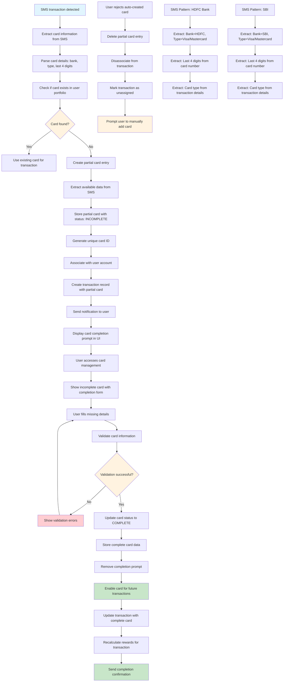

# Auto-Card Creation Flow

This flowchart illustrates the process of automatically creating credit card entries when SMS parsing detects transactions from cards not in the user's portfolio.



## Process Details

### 1. Card Detection & Extraction
1. **SMS Parsing**: Extract card information from SMS using regex patterns
2. **Data Extraction**: Parse bank name, card type, last 4 digits, and other available details
3. **Portfolio Check**: Verify if card already exists in user's credit card portfolio
4. **Decision Logic**: Determine whether to use existing card or create new entry

### 2. Auto-Card Creation
1. **Partial Data Storage**: Store available card information with incomplete status
2. **Unique ID Generation**: Create unique identifier for the new card entry
3. **User Association**: Link card to user account for proper ownership
4. **Transaction Association**: Connect transaction to the auto-created card
5. **Status Flagging**: Mark card as requiring user completion

### 3. User Notification & Completion
1. **Immediate Notification**: Alert user about detected card and completion requirement
2. **UI Integration**: Display card completion prompt in dashboard and mobile app
3. **Form Presentation**: Show completion form with pre-filled available data
4. **Validation**: Validate user-provided information against security standards
5. **Status Update**: Update card status to complete when all required fields provided

### 4. Post-Completion Processing
1. **Card Activation**: Enable card for future transactions and reward calculations
2. **Transaction Update**: Update existing transaction with complete card information
3. **Reward Recalculation**: Recalculate rewards based on complete card details
4. **Confirmation**: Send confirmation to user about successful card addition

## SMS Pattern Examples

### HDFC Bank Pattern
```
SMS: "HDFC Bank: Rs.1500.00 spent on VISA card ending 1234 at AMAZON on 15/12/2024"
Extracted Data:
- Bank: HDFC Bank
- Card Type: VISA
- Last 4 Digits: 1234
- Transaction Amount: Rs.1500.00
- Merchant: AMAZON
- Date: 15/12/2024
```

### SBI Pattern
```
SMS: "SBI: Rs.2500.00 spent on MASTERCARD ending 5678 at FLIPKART on 16/12/2024"
Extracted Data:
- Bank: SBI
- Card Type: MASTERCARD
- Last 4 Digits: 5678
- Transaction Amount: Rs.2500.00
- Merchant: FLIPKART
- Date: 16/12/2024
```

## Required Card Information

### Auto-Extracted from SMS
- **Bank Name**: Extracted from SMS sender or content
- **Card Type**: Visa, Mastercard, American Express, etc.
- **Last 4 Digits**: Last 4 digits of card number
- **Transaction Date**: Date of the detected transaction

### Required from User
- **Full Card Number**: Complete 13-19 digit card number
- **Expiry Date**: MM/YY format
- **CVV**: 3-4 digit security code
- **Cardholder Name**: Name as it appears on card
- **Credit Limit**: Optional for reward optimization
- **Annual Fee**: Optional for cost-benefit analysis

## User Experience Flow

### 1. Initial Detection
- **Push Notification**: "New card detected from transaction. Complete card details to optimize rewards."
- **Dashboard Alert**: Prominent notification in card management section
- **Mobile App**: In-app notification with quick action button

### 2. Completion Process
- **Pre-filled Form**: Available data pre-populated in completion form
- **Clear Instructions**: Step-by-step guidance for required information
- **Security Assurance**: Clear messaging about data security and encryption
- **Progress Indicator**: Visual progress bar showing completion status

### 3. Post-Completion
- **Success Confirmation**: Clear confirmation of successful card addition
- **Reward Optimization**: Immediate recalculation of rewards for existing transactions
- **Future Benefits**: Explanation of how the card will be used for optimization

## Error Handling

### SMS Parsing Errors
- **Incomplete Data**: Handle SMS with missing card information
- **Unrecognized Patterns**: Fallback for new bank SMS formats
- **Data Validation**: Verify extracted data quality and consistency
- **Duplicate Detection**: Prevent creation of duplicate card entries

### User Input Errors
- **Invalid Card Number**: Luhn algorithm validation for card numbers
- **Expired Cards**: Validation of expiry date against current date
- **Duplicate Cards**: Check for existing cards with same number
- **Security Validation**: Verify CVV format and card type compatibility

### System Errors
- **Database Failures**: Rollback mechanism for failed card creation
- **Transaction Association**: Handle orphaned transactions if card creation fails
- **User Notification**: Clear error messages for failed operations
- **Recovery Options**: Provide manual card addition as fallback

## Security Considerations

### Data Protection
- **Encryption**: All card data encrypted before storage
- **Partial Storage**: Only store necessary data for auto-creation
- **Access Control**: Strict access controls for card data
- **Audit Logging**: Complete audit trail for auto-creation events

### PCI Compliance
- **Data Minimization**: Store only required data for functionality
- **Secure Transmission**: Encrypted transmission of card data
- **Tokenization**: Use tokens instead of actual card numbers where possible
- **Regular Audits**: Periodic security audits and compliance checks

## Integration Points

### Frontend Integration
- **Dashboard Updates**: Real-time updates to card management interface
- **Mobile App**: Cross-platform synchronization of card data
- **Notification System**: Integrated notification delivery
- **Form Validation**: Client-side validation for immediate feedback

### Backend Services
- **Card Management API**: RESTful API for card operations
- **Transaction Service**: Integration with transaction processing
- **Reward Engine**: Integration with reward calculation system
- **Notification Service**: Automated notification delivery

### External Services
- **Payment Gateway**: Card validation and verification
- **Banking APIs**: Real-time card information verification
- **Security Services**: Fraud detection and risk assessment
- **Analytics Platform**: Usage tracking and optimization insights 