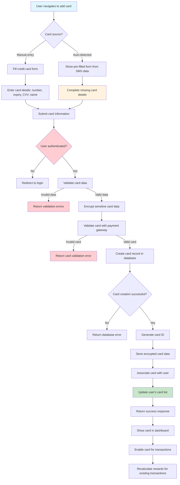

# Credit Card Addition Flow

This flowchart illustrates the process of adding a new credit card to the user's account in the Credit Card Optimizer application.

## Process Details

### Manual Card Addition
1. **Form Access**: User navigates to the credit card addition section
2. **Data Entry**: User fills out card details (number, expiry, CVV, cardholder name)
3. **Authentication Check**: System verifies user is logged in with valid JWT token
4. **Input Validation**: Backend validates card format and required fields
5. **Data Encryption**: Sensitive card information is encrypted before storage
6. **Card Verification**: Card is validated with payment gateway service
7. **Database Storage**: Card record is created in PostgreSQL database
8. **User Association**: Card is linked to the authenticated user
9. **Dashboard Update**: User's card list is updated in real-time
10. **Transaction Enablement**: Card becomes available for transaction processing

### Auto-Detected Card Completion
1. **Pre-filled Form**: System presents form with data extracted from SMS
2. **Missing Data Entry**: User completes remaining required fields
3. **Validation Process**: Same validation as manual entry process
4. **Card Completion**: Partial card entry is updated with complete information
5. **Reward Recalculation**: Existing transactions are updated with complete card data
6. **Optimization Update**: Reward optimization algorithms are re-run with new card

## Required Card Information

- **Card Number**: 13-19 digit card number
- **Expiry Date**: MM/YY format
- **CVV**: 3-4 digit security code
- **Cardholder Name**: Name as it appears on card
- **Card Type**: Visa, Mastercard, American Express, Discover

## Security Measures

- **Encryption**: Card data encrypted using AES-256
- **Tokenization**: Sensitive data replaced with secure tokens
- **PCI Compliance**: Adherence to Payment Card Industry standards
- **Access Control**: Only authenticated users can add cards
- **Audit Trail**: All card additions logged for security

## Error Handling

- **Authentication Errors**: Invalid or expired tokens return 401 status
- **Validation Errors**: Invalid card data returns 400 status
- **Card Verification Errors**: Invalid card details return 400 status
- **Database Errors**: Storage failures return 500 status
- **Gateway Errors**: Payment processor issues return 503 status

## Integration Points

- **Payment Gateway**: Real-time card validation
- **Database**: Secure card storage
- **Redis**: Session management
- **Frontend**: Real-time UI updates
- **Notification System**: Card addition confirmations 