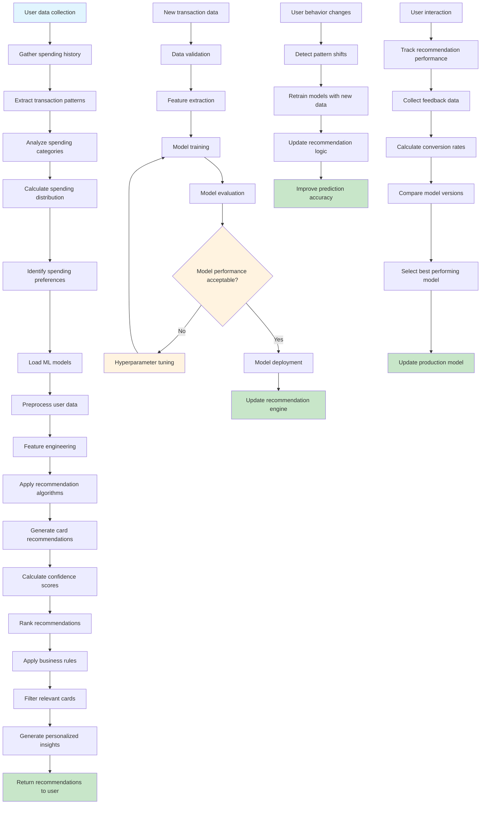

# ML Recommendation Engine Flow

This flowchart illustrates the machine learning recommendation engine that analyzes user spending patterns and suggests optimal credit card strategies.

## Process Details

### 1. Data Collection & Preprocessing
1. **User Data Gathering**: Collect comprehensive spending history and preferences
2. **Transaction Analysis**: Analyze transaction patterns, amounts, and frequencies
3. **Category Distribution**: Calculate spending distribution across categories
4. **Feature Engineering**: Extract relevant features for ML algorithms
5. **Data Validation**: Ensure data quality and consistency

### 2. Model Application
1. **Model Loading**: Load trained recommendation models from storage
2. **Feature Processing**: Transform user data into model-compatible format
3. **Algorithm Execution**: Apply recommendation algorithms to user data
4. **Confidence Scoring**: Calculate confidence levels for each recommendation
5. **Result Ranking**: Rank recommendations by relevance and confidence

### 3. Recommendation Generation
1. **Business Rule Application**: Apply business logic and constraints
2. **Card Filtering**: Filter recommendations based on user eligibility
3. **Personalization**: Customize recommendations for individual users
4. **Insight Generation**: Create personalized spending insights
5. **Response Formatting**: Format recommendations for user consumption

## ML Models & Algorithms

### Transaction Categorizer
- **NLP Processing**: Natural language processing for merchant name analysis
- **Pattern Recognition**: Identify spending patterns and categories
- **Confidence Scoring**: Assess categorization reliability
- **Continuous Learning**: Improve accuracy with new transaction data

### Recommendation Engine
- **Collaborative Filtering**: User-based and item-based recommendations
- **Content-Based Filtering**: Card features and user preferences matching
- **Hybrid Approaches**: Combine multiple recommendation strategies
- **Real-time Updates**: Dynamic recommendation updates based on new data

### Spending Pattern Analyzer
- **Time Series Analysis**: Identify seasonal and trend patterns
- **Category Clustering**: Group similar spending behaviors
- **Anomaly Detection**: Identify unusual spending patterns
- **Predictive Modeling**: Forecast future spending behavior

## Feature Engineering

### User Features
- **Demographics**: Age, income, location, family size
- **Spending Behavior**: Average transaction size, frequency, categories
- **Card Portfolio**: Current cards, credit limits, utilization
- **Preferences**: Travel, dining, shopping preferences

### Transaction Features
- **Amount**: Transaction value and frequency
- **Category**: Spending category and subcategory
- **Merchant**: Merchant type and location
- **Timing**: Time of day, day of week, seasonality

### Card Features
- **Reward Structure**: Cashback, points, miles rates
- **Category Bonuses**: Special category reward rates
- **Annual Fees**: Card costs and benefits
- **Credit Requirements**: Minimum credit score and income

## Model Training Pipeline

### Data Preparation
1. **Data Collection**: Gather historical transaction and user data
2. **Data Cleaning**: Remove duplicates, handle missing values
3. **Feature Engineering**: Create relevant features for training
4. **Data Splitting**: Split into training, validation, and test sets
5. **Normalization**: Scale features for optimal model performance

### Model Training
1. **Algorithm Selection**: Choose appropriate ML algorithms
2. **Hyperparameter Tuning**: Optimize model parameters
3. **Cross-Validation**: Validate model performance
4. **Model Evaluation**: Assess accuracy, precision, recall
5. **Model Selection**: Choose best performing model

### Deployment Process
1. **Model Serialization**: Save trained model to storage
2. **API Integration**: Integrate model with recommendation service
3. **Performance Monitoring**: Track model performance metrics
4. **A/B Testing**: Compare model versions in production
5. **Rollback Capability**: Ability to revert to previous models

## A/B Testing Framework

### Test Design
- **Hypothesis Formation**: Define test objectives and success metrics
- **Sample Selection**: Randomly assign users to test groups
- **Variant Creation**: Create different recommendation strategies
- **Traffic Allocation**: Distribute traffic between variants
- **Statistical Analysis**: Analyze results for statistical significance

### Performance Metrics
- **Conversion Rate**: Percentage of users who apply recommendations
- **Engagement Rate**: User interaction with recommendations
- **Reward Optimization**: Improvement in reward earnings
- **User Satisfaction**: Feedback and rating scores
- **Retention Rate**: User retention and engagement over time

### Continuous Improvement
- **Data Collection**: Gather performance data from all variants
- **Analysis**: Analyze results and identify winning strategies
- **Model Updates**: Incorporate learnings into model training
- **Feature Engineering**: Improve features based on insights
- **Algorithm Refinement**: Enhance recommendation algorithms

## Integration Points

### Data Sources
- **Transaction Database**: Historical transaction data
- **User Profiles**: User preferences and demographics
- **Card Database**: Credit card features and benefits
- **External APIs**: Market data and card information

### ML Infrastructure
- **Model Storage**: Secure storage for trained models
- **Training Pipeline**: Automated model training workflows
- **Inference Service**: Real-time prediction service
- **Monitoring Tools**: Model performance and health monitoring

### Application Services
- **Recommendation API**: RESTful API for recommendations
- **User Interface**: Web and mobile recommendation displays
- **Notification Service**: Push recommendations to users
- **Analytics Platform**: Track recommendation performance

## Performance Optimization

### Model Efficiency
- **Caching**: Cache frequently used model predictions
- **Batch Processing**: Process recommendations in batches
- **Parallel Processing**: Parallel execution of ML algorithms
- **Model Compression**: Optimize model size for faster inference

### Scalability
- **Horizontal Scaling**: Scale ML services across multiple instances
- **Load Balancing**: Distribute requests across ML service instances
- **Database Optimization**: Optimize database queries for ML workloads
- **CDN Integration**: Cache static model assets globally

### Real-time Processing
- **Streaming**: Process recommendations in real-time
- **Event-driven**: Trigger recommendations based on user events
- **Low Latency**: Minimize response time for recommendations
- **Async Processing**: Handle background ML tasks asynchronously

## Security & Privacy

### Data Protection
- **Encryption**: Encrypt all user data and model artifacts
- **Access Control**: Role-based access to ML models and data
- **Audit Logging**: Log all ML operations and data access
- **Data Anonymization**: Anonymize sensitive user data

### Model Security
- **Model Validation**: Validate model outputs for security
- **Adversarial Testing**: Test models against adversarial inputs
- **Version Control**: Track model versions and changes
- **Secure Deployment**: Secure model deployment and updates

### Privacy Compliance
- **GDPR Compliance**: Ensure data processing compliance
- **Data Minimization**: Collect only necessary data
- **User Consent**: Obtain explicit consent for data processing
- **Right to Deletion**: Support user data deletion requests 