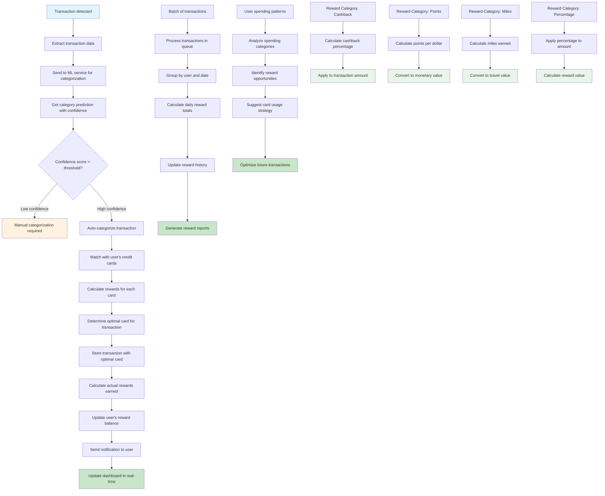

# Reward Calculation & Optimization Flow

This flowchart illustrates the complete process of calculating and optimizing credit card rewards based on transaction data and user's card portfolio.

## Process Details

### 1. Transaction Processing
1. **Transaction Detection**: SMS parsing or manual entry captures transaction
2. **Data Extraction**: Amount, merchant, date, and description extracted
3. **ML Categorization**: Transaction sent to ML service for automatic categorization
4. **Confidence Assessment**: System evaluates categorization confidence
5. **Category Assignment**: High-confidence transactions auto-categorized, low-confidence flagged for review

### 2. Reward Calculation
1. **Card Matching**: System identifies user's credit cards applicable to transaction
2. **Rate Calculation**: Reward rates calculated for each card based on category
3. **Optimization**: Algorithm determines which card maximizes rewards
4. **Reward Computation**: Actual rewards calculated based on optimal card selection
5. **Balance Update**: User's reward balance updated with earned rewards

### 3. Real-time Updates
1. **Notification**: User notified of transaction and rewards earned
2. **Dashboard Update**: Real-time updates to web and mobile dashboards
3. **History Tracking**: Transaction and reward history maintained
4. **Analytics**: Spending patterns and reward optimization insights generated

## Reward Categories

### Cashback Rewards
- **Percentage-based**: 1-5% cashback on eligible purchases
- **Category-specific**: Higher rates for specific spending categories
- **Tiered structure**: Different rates based on spending thresholds
- **Immediate credit**: Cashback applied to statement or account

### Points Rewards
- **Points per dollar**: 1-3 points per dollar spent
- **Category multipliers**: Bonus points for specific categories
- **Redemption options**: Points convertible to cash, travel, or merchandise
- **Point valuation**: Dynamic point-to-dollar conversion rates

### Miles Rewards
- **Miles per dollar**: 1-2 miles per dollar spent
- **Airline partnerships**: Miles transferable to partner airlines
- **Travel redemption**: Miles used for flights, upgrades, or travel expenses
- **Elite status**: Miles contributing to airline elite status

### Percentage Rewards
- **Fixed percentage**: Consistent reward rate across all purchases
- **Category bonuses**: Enhanced rates for preferred categories
- **Statement credits**: Rewards applied as statement credits
- **Annual caps**: Maximum rewards per year with rollover options

## Optimization Algorithm

### Multi-Card Strategy
1. **Card Portfolio Analysis**: Evaluate all user's credit cards
2. **Category Mapping**: Match transaction categories to card benefits
3. **Rate Comparison**: Compare reward rates across all applicable cards
4. **Optimal Selection**: Choose card with highest reward potential
5. **Future Planning**: Suggest optimal card usage for upcoming transactions

### Spending Pattern Analysis
1. **Historical Data**: Analyze past spending patterns
2. **Category Distribution**: Identify primary spending categories
3. **Reward Optimization**: Suggest card combinations for maximum rewards
4. **Strategy Recommendations**: Provide personalized card usage advice

## Performance Features

### Real-time Processing
- **Instant Calculation**: Rewards calculated immediately upon transaction
- **Live Updates**: Dashboard updates in real-time
- **Push Notifications**: Immediate alerts for rewards earned
- **Mobile Sync**: Cross-platform synchronization

### Batch Processing
- **Queue Management**: Background processing of transaction batches
- **Daily Aggregation**: Daily reward totals calculated automatically
- **Monthly Reports**: Comprehensive monthly reward summaries
- **Annual Analysis**: Year-end reward optimization reports

## Integration Points

### ML Services
- **Transaction Categorization**: AI-powered category prediction
- **Pattern Recognition**: Spending pattern analysis and insights
- **Optimization Suggestions**: ML-driven card recommendation engine
- **Confidence Scoring**: Reliability assessment for categorizations

### Database Systems
- **Transaction Storage**: PostgreSQL for transaction and reward data
- **User Profiles**: User preferences and card portfolio management
- **Reward History**: Comprehensive reward tracking and analytics
- **Audit Trail**: Complete transaction and reward audit logs

### External Services
- **Banking APIs**: Real-time transaction data integration
- **Payment Processors**: Transaction verification and processing
- **Notification Services**: Email, SMS, and push notification delivery
- **Analytics Platforms**: Advanced reporting and insights

## Error Handling

### Categorization Errors
- **Low Confidence**: Manual review required for uncertain categorizations
- **Unknown Categories**: Fallback to general category assignment
- **ML Service Failures**: Graceful degradation to rule-based categorization
- **Data Quality Issues**: Validation and correction of transaction data

### Calculation Errors
- **Rate Mismatches**: Handling of outdated or incorrect reward rates
- **Card Ineligibility**: Managing cards not applicable to specific transactions
- **System Failures**: Backup calculation methods and error recovery
- **Data Inconsistencies**: Validation and correction of reward calculations

## Security & Compliance

### Data Protection
- **Encryption**: All transaction and reward data encrypted
- **Access Control**: Role-based access to reward calculations
- **Audit Logging**: Complete audit trail for all reward operations
- **PCI Compliance**: Secure handling of payment-related data

### Regulatory Compliance
- **Reward Disclosure**: Clear communication of reward terms and conditions
- **Tax Reporting**: Accurate tracking for tax reporting requirements
- **Consumer Protection**: Compliance with financial services regulations
- **Data Privacy**: GDPR and other privacy regulation compliance 