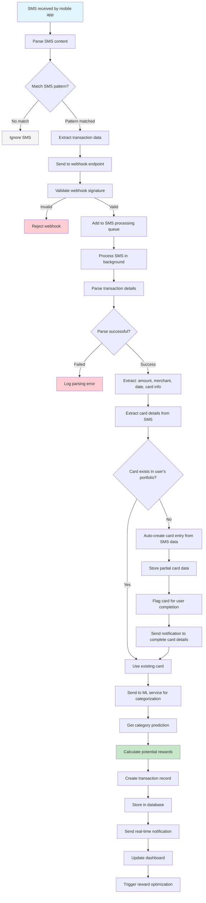

# SMS Transaction Detection Flow

This flowchart illustrates the complete process of detecting and processing transactions from SMS notifications in the Credit Card Optimizer application.

## Process Details

1. **SMS Reception**: Mobile app receives SMS notification from bank
2. **Pattern Matching**: System matches SMS against predefined bank patterns (HDFC, SBI, ICICI, Axis)
3. **Data Extraction**: Transaction details and card information extracted using regex patterns
4. **Webhook Processing**: SMS data sent to backend via secure webhook
5. **Queue Management**: Transaction added to Redis-based processing queue
6. **Background Processing**: SMS processed asynchronously to avoid blocking
7. **Card Detection**: System checks if card exists in user's portfolio
8. **Auto-Card Creation**: If card not found, creates partial card entry from SMS data
9. **User Notification**: Prompts user to complete card details in frontend
10. **ML Categorization**: Transaction sent to ML service for automatic categorization
11. **Card Optimization**: System determines best credit card for the transaction
12. **Database Storage**: Transaction record created in PostgreSQL
13. **Reward Calculation**: Potential rewards calculated based on card benefits
14. **Real-time Updates**: User notified and dashboard updated immediately
15. **Optimization Trigger**: Reward optimization algorithms triggered

## SMS Patterns Supported

- **HDFC Bank**: `HDFC Bank: Rs.(\d+(?:\.\d{2})?) spent on (\w+) at (.+) on (\d{2}\/\d{2}\/\d{4})`
- **SBI**: `SBI: Rs.(\d+(?:\.\d{2})?) spent on (\w+) at (.+) on (\d{2}\/\d{2}\/\d{4})`
- **ICICI Bank**: `ICICI Bank: Rs.(\d+(?:\.\d{2})?) spent on (\w+) at (.+) on (\d{2}\/\d{2}\/\d{4})`
- **Axis Bank**: `Axis Bank: Rs.(\d+(?:\.\d{2})?) spent on (\w+) at (.+) on (\d{2}\/\d{2}\/\d{4})`

## Extracted Data

- **Amount**: Transaction amount in rupees
- **Merchant**: Store or service provider name
- **Date**: Transaction date and time
- **Card Information**: Card type, last 4 digits, bank name
- **Transaction Type**: Purchase, withdrawal, etc.

## ML Categorization

- **Food & Dining**: Restaurants, groceries, food delivery
- **Shopping**: Retail stores, online shopping
- **Travel**: Flights, hotels, transportation
- **Entertainment**: Movies, events, streaming services
- **Utilities**: Bills, services, subscriptions
- **Healthcare**: Medical expenses, pharmacies
- **Education**: Courses, books, training
- **Other**: Miscellaneous transactions

## Error Handling

- **Pattern Mismatch**: SMS not recognized as transaction
- **Parsing Errors**: Invalid SMS format or missing data
- **Webhook Failures**: Network issues or invalid signatures
- **Queue Failures**: Redis connection or processing errors
- **ML Service Errors**: Categorization service unavailable
- **Database Errors**: Storage or constraint violations

## Performance Optimizations

- **Asynchronous Processing**: Non-blocking SMS processing
- **Queue Management**: Redis-based job queues
- **Batch Processing**: Multiple SMS processed together
- **Caching**: Frequently used data cached in Redis
- **Connection Pooling**: Database connection optimization

## Integration Points

- **Mobile App**: SMS reading and webhook sending
- **ML Services**: Transaction categorization
- **Database**: Transaction storage and retrieval
- **Redis**: Queue management and caching
- **Notification System**: Real-time user alerts
- **Dashboard**: Live transaction updates 